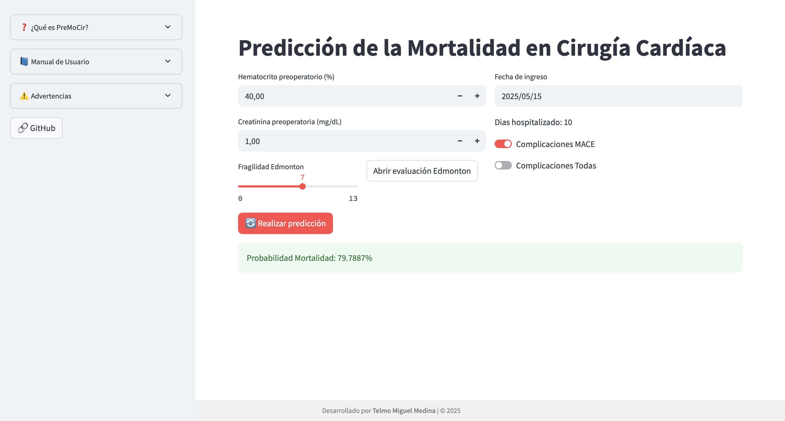

# PreMoCir
🔗 **Accede a la aplicación aquí:** [PreMoCir](https://premocir.streamlit.app)

# 📘 MANUAL DE USUARIO

## 1. 📝 Introducción de datos

Introduce los siguientes valores en los campos visibles:

- **Hematocrito preoperatorio (%)**  
  Ingrese el valor del hematocrito antes de la operación.

- **Creatinina preoperatoria (mg/dL)**  
  Ingrese el nivel de creatinina preoperatoria.

- **Fragilidad Edmonton (0–17)**  
  Seleccione el nivel de fragilidad según la escala de Edmonton.

- **Fecha de ingreso hospitalario**  
  Seleccione la fecha en que el paciente fue ingresado al hospital.

- **Complicaciones MACE** *(toggle)*  
  Actívelo si el paciente ha tenido **eventos cardiovasculares graves**.

- **Complicaciones TODAS** *(toggle)*  
  Actívelo si el paciente ha tenido **cualquier tipo de complicación médica relevante**.

---

## 2. ⚙️ Realizar predicción

1. Pulsa el botón **🔄 Realizar predicción**.
2. La aplicación mostrará la **probabilidad de mortalidad estimada** en porcentaje.

---

